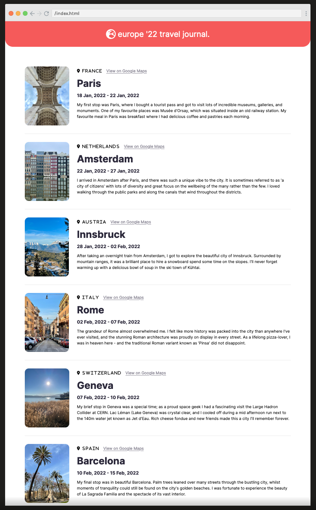

# Scrimba 'Learn React' Section 2 Solo Project:
## _"Build a Travel Journal"_

This project is a travel journal site that was built using React, summarising the places that I visited
when interrailing in early 2022.

I worked on this project to practice the React concepts that were covered in section two
of the course. The code was written within the Scrimba environment and is really easy to check it
in your own browser here: https://scrimba.com/scrim/coa5049889821203f4aa9d847

## Supporting Scrimba

Since 2017, we have created over 20 free courses on Scrimba, and we're going to
continue launching free courses. But to pay our bills, we have to charge once
in a while. So if you've ever wanted to "give back" to Scrimba, you can do that by buying
one of our paid courses

- [Become a professional React developer](https://scrimba.com/course/greact)
- [The Responsive Web Design Bootcamp](https://scrimba.com/course/gresponsive)
- [The Ultimate JavaScript Bootcamp](https://scrimba.com/course/gjavascript)

  It would also mean the world to us if you share the courses.

Happy Coding!
